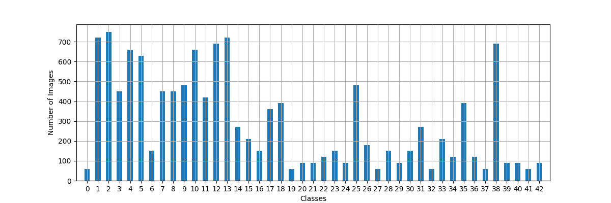
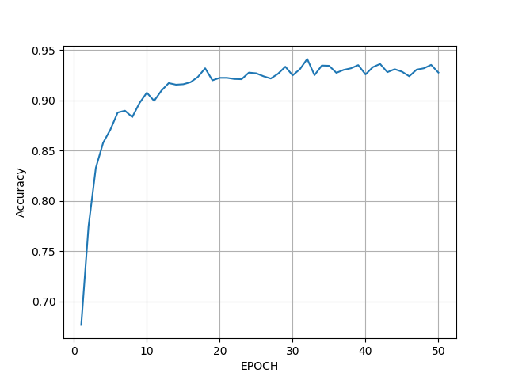
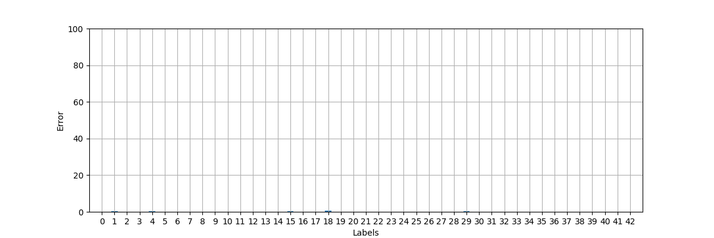
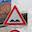

# **Traffic Sign Recognition** 

---

**Build a Traffic Sign Recognition Project**

The steps of this project are the following:
1. Load the data set
1. Explore, summarize and visualize the data set
1. Preprocess Datasets
1. Design, train and test a model architecture
1. Use the model to make predictions on new images
1. Analyze the softmax probabilities of the new images

---
## Development

### Development Files

| File | Description |
| ------ | ------ |
| Plots.py | Predefined Plot Functions |
| networks.py | Neural Network Model Implementations | 
| trainer.json | Train and Evaluate Models | 
| imageClassifier.py | Classify Images |

### Data Set Summary & Exploration

After loading the provided dataset files, the following results were found:

* The size of training set is 34799
* The size of the validation set is 4410
* The size of test set is 12630
* The shape of a traffic sign image is (32,32,3)
* The number of unique classes/labels in the data set is 43

The sample distribution for each dataset and its statistics are presented below:

#### Training Dataset

#### Validation Dataset

#### Testing Dataset

#### Datasets Means

#### Datasets Standard Deviations

### Proprocess

In order to obtain better results, 3 steps of preprocessing was implemented:

#### 1. Grayscale Conversion

After multiple tests with differente color maps and channels, it was notice that a single channel grayscale image obtained the best results for this model.

#### 2. Histogram Equalization

In order to ajust light conditions, the histogram equalizatiton was applyied to the grayscale images

#### 3. Normalization

Since data should be normalized for better results, each image was normalized by the equation `(Pixel_Value -128)/128`

#### Preprocessing Results

In the image below, a original image and its 3 preprocess steps can be observed:

### Model Architecture

The designed model architecture can be seen on the image below:

The final model consisted of the following layers:

#### Convolution
| Layer         | Input           | Input Shape | Filter | Stride | Output Shape | Activation Function |
|---------------|-----------------|-------------|--------|--------|--------------|---------------------|
| Convolution 1 | Grayscale Image | 32x32x1     | 5x5x32 | 1x1    | 28x28x32     | RELU                |
| MaxPool 1     | Convolution 1   | 28x28x32    |        | 2x2    | 14x14x32     |                     |
| Convolution 2 | MaxPool 1       | 14x14x32    | 5x5x32 | 1x1    | 10x10x64     | RELU                |
| MaxPool 2     | Convolution 2   | 10x10x64    |        | 2x2    | 5x5x64       |                     |
| Convolution 3 | MaxPool 2       | 5x5x64      | 5x5x32 | 1x1    | 1x1x128      | RELU                |

#### Fully Connected
| Layer             | Input             | Inputs | Outputs | Activation Function |
|-------------------|-------------------|--------|---------|---------------------|
| Fully Connected 1 | Convolution 3     | 128    | 1024    | RELU                |
| Fully Connected 2 | Fully Connected 1 | 1024   | 256     | RELU                |
| Fully Connected 3 | Fully Connected 2 | 256    | 43      |                     |

#### Dropout

In order to prevent overfitting, a dropout regularization added to the model:

| Layer             | Keep Probability |
|-------------------|------------------|
| Convolution 1     | 0.9              |
| Convolution 2     | 0.9              |
| Convolution 3     | 0.9              |
| Fully Connected 1 | 0.8              |
| Fully Connected 2 | 0.8              |

 ### Model Traning
 
 In order to obtain the final trained model, multiple tests were executed in order to find the best results. The provided learning rate of 0.001 and batch size of 128 resulted in good results and were not changed. In the other hand, the number of epochs was too short for obtaining the necessary 0.93 accuracy, so it was changed to 50 epochs.
 
 | Hyperparameter   | Value |
 |------------------|-------|
 | Learning Rate    | 0.001 |
 | Batch Size       | 128   |
 | Number of Epochs | 50    |
 
 
 After some tests, it was noticed that many times, the best accuracy was not found on the last epoch. In order to fix that, the training process was changed in a way that it always saves the best accuracy found, instead of the last epoch. 
 
 The training process was then executed, resulting in the following results:
 
 #### Max Accuracy Epoch: 32
 

 
 
 #### Training Set Accuracy: 0.9991
 

 
 #### Validation Set Accuracy: 0.9678
 

 
 #### Test Set Accuracy: 0.9393
 

 
 
 
 

### Testing Model on New Images

In order to test the trained model, 8 external images were predicted by the network. All images were rescaled to a size of 32x32 and labeled to its respective label. After the execution of the script, all images were predicted correctly. The individualy results can be seen below:

#### 2 - Speed limit (50km/h)

|             |   1°   |   2°   |   3°   |   4°   |   5°   |
|-------------|--------|--------|--------|--------|--------|
| Probability | 99.99 | 9.82e-4 | 8.42e-4 | 2.84e-05 | 7.83e-07 |
| Label       | 2 | 1 | 3 | 5 | 38 |

#### 4 - Speed limit (70km/h)

|             |   1°   |   2°   |   3°   |   4°   |   5°   |
|-------------|--------|--------|--------|--------|--------|
| Probability | 99.99 | 6.93e-06 | 1.89e-06 | 5.60e-07 | 2.85e-07 |
| Label       | 4 | 8 | 1 | 2 | 0 |

#### 13 - Yield

|             |   1°   |   2°   |   3°   |   4°   |   5°   |
|-------------|--------|--------|--------|--------|--------|
| Probability | 99.99 | 4.31e-14 | 1.51e-17 | 1.25e-17 | 5.45e-18 |
| Label       | 13 | 38 | 3 | 1 | 15 |

#### 14 - Stop

|             |   1°   |   2°   |   3°   |   4°   |   5°   |
|-------------|--------|--------|--------|--------|--------|
| Probability | 98.24 | 1.75 | 2.65e-04 | 4.82e-05 | 3.86e-05 |
| Label       | 14 | 12 | 33 | 9 | 17 |

#### 17 - No entry

|             |   1°   |   2°   |   3°   |   4°   |   5°   |
|-------------|--------|--------|--------|--------|--------|
| Probability | 99.99 | 1.90e-21 | 7.56e-22 | 8.61e-26 | 7.57e-26 |
| Label       | 17 | 14 | 38 | 34 | 9 |

#### 22 - Bumpy road

|             |   1°   |   2°   |   3°   |   4°   |   5°   |
|-------------|--------|--------|--------|--------|--------|
| Probability | 99.99 | 5.33e-3 | 1.37e-4 | 5.26e-05 | 2.93e-05 |
| Label       | 22 | 29 | 3 | 31 | 28 |

#### 28 - Children crossing

|             |   1°   |   2°   |   3°   |   4°   |   5°   |
|-------------|--------|--------|--------|--------|--------|
| Probability | 99.99 | 1.37e-4 | 1.87e-05 | 7.52e-06 | 2.67e-06 |
| Label       | 28 | 29 | 24 | 1 | 30 |

#### 33 - Turn right ahead

|             |   1°   |   2°   |   3°   |   4°   |   5°   |
|-------------|--------|--------|--------|--------|--------|
| Probability | 99.99 | 2.80e-10 | 4.45e-12 | 1.13e-13 | 9.65e-14 |
| Label       | 33 | 35 | 1 | 37 | 4 |

